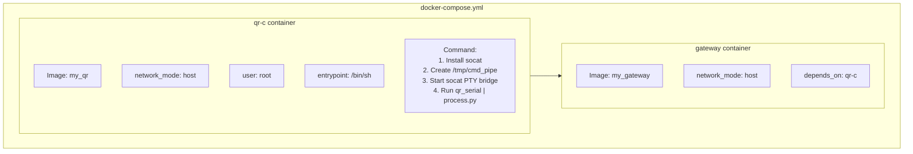

# bloq_it - Architecture Diagram

## System Overview

This document describes the architecture of the bloq_it QR Scanner IoT Gateway system.

---

## High-Level Architecture


---

## Detailed Component Diagram


---

## Data Flow Sequence


---

## Component Details

### MQTT Topics

| Topic | Direction | Publisher | Subscriber | Purpose |
|-------|-----------|-----------|------------|---------|
| `olno/commands` | External → Gateway | External clients | gateway (main.py) | Control commands from external systems |
| `olno/dev_cmd` | Gateway → QR-C | gateway (main.py) | process.py | Forwarded commands to QR device |
| `olno/events` | QR-C → External | process.py | gateway (main.py), External clients | QR scan events and responses |

### Ports & Interfaces

| Interface | Type | Port/Path | Description |
|-----------|------|-----------|-------------|
| MQTT Broker | TCP | 1883 | Default MQTT port (TLS: 8883) |
| Serial Port 1 | PTY | `/dev/ttyS1` | qr_serial ↔ socat |
| Serial Port 2 | PTY | `/dev/ttyS2` | process.py ↔ socat (simulation) |
| Command Pipe | FIFO | `/tmp/cmd_pipe` | process.py → qr_serial stdin |
| Serial Baud | Config | 115200 | Serial communication speed |

### QR-C Commands

| Command | Description | Response |
|---------|-------------|----------|
| `INIT` | Initialize serial port, set state to READY | `OK` |
| `PING` | Health check | `PONG` |
| `START` | Begin QR scan (blocking with timeout) | JSON event |
| `STOP` | Abort ongoing scan | Scan aborted |

### Environment Variables (qr-c)

| Variable | Default | Description |
|----------|---------|-------------|
| `SERIAL_PORT` | `/dev/ttyS1` | Serial device path |
| `SERIAL_BAUD` | `115200` | Baud rate |
| `READ_TIMEOUT_MS` | `10000` | Read timeout in milliseconds |

---

## Container Architecture



---

## ASCII Architecture (Original)

```
┌─────────────────────────────────────────────────────────────────────────────┐
│                              Docker Compose                                 │
├─────────────────────────────────────────────────────────────────────────────┤
│                                                                             │
│  ┌────────────────────────────────────────────────────────────────────┐     │
│  │                        qr-c container                              │     │
│  │                                                                    │     │
│  │   MQTT Broker (test.mosquitto.org:1883)                            │     │
│  │         │                                                          │     │
│  │         │ olno/dev_cmd                                             │     │
│  │         ▼                                                          │     │
│  │   ┌─────────────┐   /tmp/cmd_pipe    ┌────────────┐                │     │
│  │   │ process.py  │───────────────────►│ qr_serial  │ (C program)    │     │
│  │   │             │    (named pipe)    │   stdin    │                │     │
│  │   └─────────────┘                    └────────────┘                │     │
│  │         │  ▲                               │  ▲                    │     │
│  │         │  │ stdout (JSON)                 │  │                    │     │
│  │         │  └───────────────────────────────┘  │                    │     │
│  │         │                                     │                    │     │
│  │         │  /dev/ttyS2              /dev/ttyS1 │                    │     │
│  │         │      │                       │      │                    │     │
│  │         │      ▼                       ▼      │                    │     │
│  │         │    ┌───────────────────────────┐    │                    │     │
│  │         │    │      socat PTY bridge     │    │                    │     │
│  │         │    │  (virtual serial ports)   │    │                    │     │
│  │         │    └───────────────────────────┘    │                    │     │
│  │         │                 │                   │                    │     │
│  │         │                 ▼                   │                    │     │
│  │         │          [QR Scanner HW]            │                    │     │
│  │         │                                     │                    │     │
│  │         │ olno/events                         │                    │     │
│  │         ▼                                     │                    │     │
│  │   MQTT Broker ◄───────────────────────────────┘                    │     │
│  └────────────────────────────────────────────────────────────────────┘     │
│                                                                             │
│  ┌────────────────────────────────────────────────────────────────────┐     │
│  │                       gateway container                            │     │
│  │                                                                    │     │
│  │   ┌─────────────┐                                                  │     │
│  │   │   main.py   │  MQTTClientManager                               │     │
│  │   └─────────────┘                                                  │     │
│  │         │                                                          │     │
│  │         │ Subscribes: olno/events, olno/commands                   │     │
│  │         │ Publishes:  olno/dev_cmd (forwards commands)             │     │
│  │         ▼                                                          │     │
│  │   MQTT Broker (test.mosquitto.org:1883)                            │     │
│  └────────────────────────────────────────────────────────────────────┘     │
│                                                                             │
└─────────────────────────────────────────────────────────────────────────────┘

                              ▲
                              │
                    External MQTT Clients
                    (olno/commands, olno/events)
```
